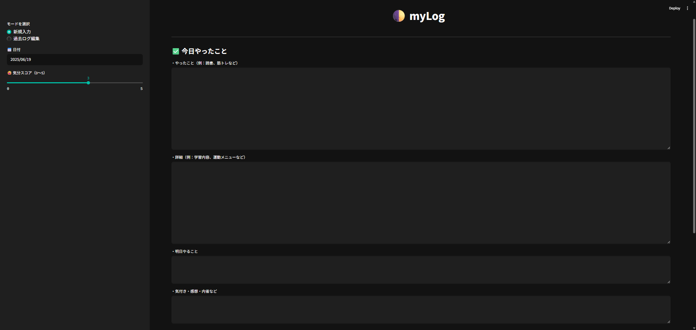
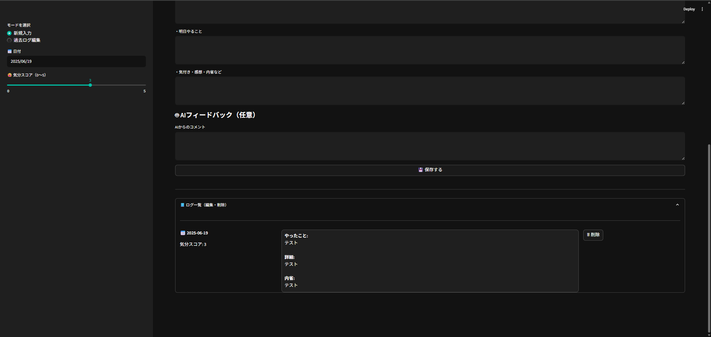

# 📝 myLog - 日次ログ記録ツール

「今日やったこと・気づき・明日やること・気分スコア」を1画面で記録する自己ログアプリ。  
Streamlit製のシンプルなライフログツールです。

---

## 🚀 機能一覧

- 日次の記録（行動・詳細・内省・気分スコア）
- 気分スコアのグラフ表示
- ログの編集・削除機能（サイドバー対応）
- CSV形式で自動保存

---

## 🧰 使用技術

- [Streamlit](https://streamlit.io/)
- [Pandas](https://pandas.pydata.org/)

---

## 🖥️ 起動方法（初回）
```bash
git clone https://github.com/yourname/life_logger.git
cd life_logger
python -m venv venv
venv\Scripts\activate   # ← Windows の場合
pip install -r requirements.txt
streamlit run app.py
```
---

## 🧠 このアプリの狙い
- 日記より軽く、ToDoより深く
- 内省・習慣化・感情の記録を毎日3分で完結
- ローカル実行＆CSV保存で超シンプルに使える自己観察ツール

## 🖼️ スクリーンショット
### 📝 入力画面


### 📖 ログ表示画面
